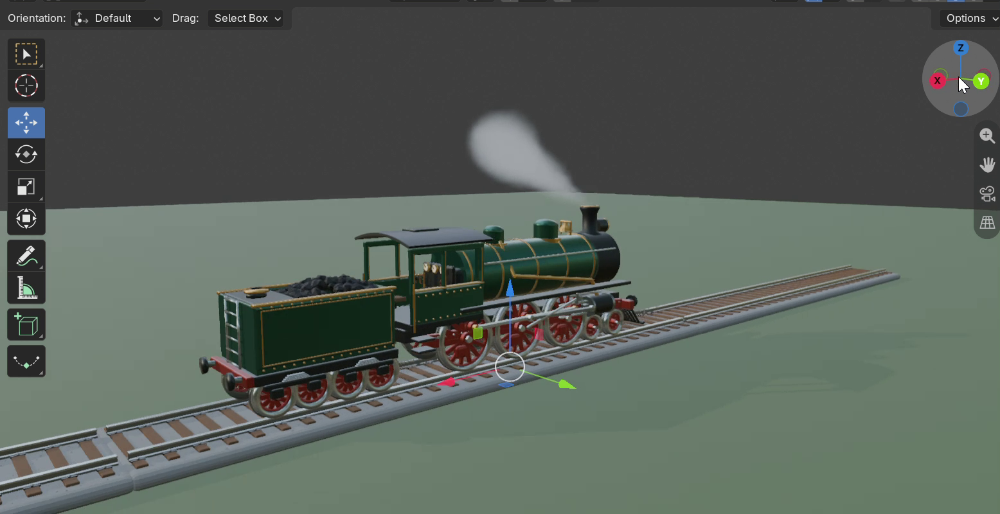

# Steam Locomotive — Built by AI in Blender

A classic steam locomotive + coal tender, modeled, textured, and animated **entirely by an AI agent** connected to Blender through the [blender-mcp](https://github.com/ahujasid/blender-mcp) server — from a single prompt.

## Contents

| File | Description |
|------|-------------|
| `steam_train_animated.blend` | Full Blender scene — model, materials, smoke, track, animation |
| `train.mp4` | ~15s animation preview |
| `preview.png` | Still frame |

## How it was made

1. Blender MCP server connected to the AI model
2. One prompt: *"create a steam engine train"*
3. The agent planned, modeled, shaded, and animated the scene autonomously — no manual editing

Open `steam_train_animated.blend` in Blender and press <kbd>Space</kbd> to play the animation.
